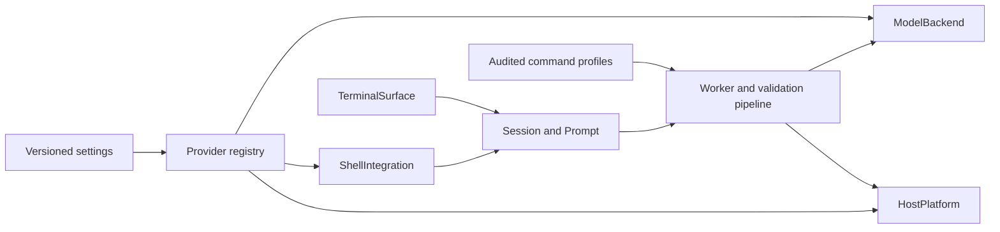

# Architecture overview

## Alpha-v1 amendment

See [the executable boundary map](14_Alpha_Conformance.md). Host facts are data
injected into a shared production candidate gate, not precomputed verdicts.
An independent Python alpha profile compares the complete deterministic trace.
Before inference, explicit supported contracts and verified literal commands can
produce deterministic candidates; the shared final pipeline still revalidates
and binds them. Model-candidate diagnostics bypass this optimization, not policy.
Staging binds session/request/context/prompt generations, CWD, input and local
prompt state. Only fixed integration keys cross the assistant-to-VTE adapter;
Bash reads candidate text as data and checks its own prompt generation again.
Native inference reports numeric load/prefill/decode timings over bounded IPC.
Session metrics have fixed-size counters only, with manual clipboard export.
Worker events wake a GLib future rather than a repeating window timer. The per-tab
60 ms shell poll remains: FIFO readiness alone did not ensure VTE had processed
the corresponding output, so the attempted replacement failed real-PTY tests.

> Scope: terminal application. Reviewed 2026-09-10 for the split workspace.
> Code is in `terminal/`; commands run from the repository root unless stated otherwise.
> Model research is documented in [llm/README.md](../../llm/README.md).

## Current production pipeline

```mermaid
flowchart LR
  User -->|typing and Enter| VTE[VTE / Bash PTY per tab]
  VTE -->|Readline and prompt events| Session[Isolated bounded session]
  Session --> Gate[Passive eligibility gate]
  Session -->|explicit @| Worker[Single inference worker]
  Gate --> Worker
  Session -->|failure or suggested command completion| Worker
  Worker --> Known[Known host facts / common find guidance]
  Known -->|command| Host
  Known -->|no direct answer| Model[Supervised llama.cpp / resident GGUF]
  Model --> JSON[Constrained response parser]
  JSON --> Host[alpha-v1 parser / CLI / intent / secrets]
  Host -->|eligible option error| Check[Deterministic canonical correction]
  Check -->|recheck every gate| Host
  Host -->|unverifiable| Stop[No suggestion / explicit retry offer]
  User -->|Retry suggestion once, unchanged context| Worker
  Host -->|valid| Risk[Deterministic risk check]
  Risk -->|accepted| Suggestion[Suggestion display]
  User -->|Tab| Readline[Readline staging widget]
  Suggestion -->|single printable line as data| Readline
  Readline -->|editable buffer, no Enter| VTE
```

The GTK main thread never performs model inference. One worker owns model weights
and a bounded request mailbox. Each request creates fresh KV state to prevent
cross-tab leakage. Request tickets invalidate stale results when input changes,
a tab closes, or AI is disabled. No model or validator receives a PTY handle.

Bash is started with a private rcfile that sources the user's `.bashrc`, selects
Emacs Readline mode, and installs prompt/accept/snapshot/staging widgets. Prompt
and command events use a private per-tab authenticated NUL-delimited FIFO; VTE provides
bounded text ranges between observed command boundaries. stdout and stderr are
combined by the PTY. This is semantic shell integration plus VTE text extraction,
not pixel scraping. Display OSC events never establish trusted prompt state.

The shell staging widget reads a candidate as data into `READLINE_LINE` only if
the prompt generation, physical CWD and actual input still match. The host only sends fixed
widget key sequences to VTE. It does not send generated command bytes or Enter.

All running or unknown foreground programs pause assistance until the original
local Bash prompt returns, including SSH and wrappers. Remote shell integration is a
later milestone. The core context and documentation boundaries already exclude
local machine evidence from remote requests.

## UI revision — terminal-first split

The assistant is a read-only monospace text buffer with the same background and
font as VTE, separated by a thin resizable divider. Plain-text rendering avoids
interpreting model output as terminal control sequences. There are no welcome
cards, stage buttons, branded header, or persistent inference-metric footers.
Ready state is `Ready..`; diagnostics appear only when relevant. Tabs are compact,
reorderable, and managed through keyboard shortcuts and a small tab-bar menu.

## Context and validation revision

Input reads are coalesced into one Readline snapshot after 150 ms idle. Passive
inference is eligible after 250 ms and waits for that snapshot. The suggestion
strip reserves one line, so suggestions do not resize VTE. A full worker mailbox
may defer passive enqueueing; it never repeats a completed inference. The small AI status indicates thinking.

Every failed foreground command (except interrupts) and every completed assistant
suggestion can trigger one observation. There is no inference loop without new
input or a new command result. Successful unrelated commands stay quiet. Original
intent is stored separately from the rotating conversation.

Host facts include ID/ID_LIKE, native package manager, trusted executable
availability, and required pacman privileges. The alpha manifest defines staged
CLI coverage; cached help is quoted explanatory evidence, not authorization.
Unknown coverage fails closed. Deterministic corrections cross every final gate.
Unverifiable explicit responses may offer one separately requested inference;
safety/secret rejection and passive requests never retry.

An initial operation-level rule rejects pacman package/file searches for a system
update intent. This is narrow semantic coverage, not general intent verification.

## Direct host guidance and prose checks

Known package-manager mismatches and common paused `find` input now have a direct
host-owned response path. This covers failed `apt update`, `apt get upgrade`,
`@ explain the error`, bare `find`, missing find operands, and unquoted patterns.
These cases require no inference. Any command still crosses installed CLI and
risk validation before it becomes a ghost; missing filenames are not invented.

Other requests continue through Qwen. Prose is checked for known dismissive
phrases and unsupported claims of execution. Invalid prose ends that inference
without an automatic repair. This is a bounded response-quality check,
not a guarantee that every model response is accurate or well phrased.

## Flag assistance

A trailing dash, short flag, or long-flag prefix triggers local option guidance
for the current command (including the last member of a pipeline). ps uses its
full installed help; known tools use fixed help routes and other installed tools
can fall back to man pages. No arbitrary program is executed merely to discover
its options. Descriptions are filtered by prefix without inference; missing
evidence is reported directly. Help reads are capped at 64 KiB and man fallback
caches at 128 entries. Option lists do not stage or execute a guessed flag.

Earlier assistant text clears on input invalidation so unrelated advice does not
remain alongside a new command. Readline snapshots remain coalesced despite the
shorter idle interval.

## Appearance and desktop assets

Six embedded theme records provide foreground/background, ANSI 16-color palette,
cursor, selection, and application colors. A stateful Theme menu action applies
a palette to every terminal in the current window and reloads shared GTK CSS;
new tabs inherit the selected palette without restarting their shells. Theme
preferences are written atomically while preserving other settings fields.

The caiman SVG is bundled as a GLib resource for window icons and installed as a
freedesktop hicolor icon for launchers/taskbars. `terminal/packaging/install.py` installs a
separate desktop binary, model-aware launcher, desktop entry, man page, and theme
credits. Neither the graphic nor a startup banner displaces the minimal Ready..
assistant state. The ASCII mascot appears only in CLI help.

## Maintainable providers and configuration

The current implementations remain Linux, GTK/VTE, Bash and local llama.cpp.
No additional platform rules, model downloads, or terminal implementations are
bundled by this refactor. The contracts establish where those implementations
can be added; they do not make this version cross-platform.

| Boundary | Current implementation | Adding support |
| --- | --- | --- |
| `adapters::ModelBackend` | llama.cpp with GGUF chat template, tokenizer and grammar | Implement generation/cancellation, register its factory and descriptor, and pass the shared harness. Keep command execution outside the backend. |
| `terminal_backend::TerminalSurface` | VTE context text and fixed integration keys | Implement the surface contract and frontend construction. Worker/context code remains independent of GTK. |
| `adapters::ShellIntegration` | Bash bootstrap, launch arguments, snapshot/stage keys | Implement shell event and staging protocol and register it. Prove staging never submits Enter. |
| `platform::HostPlatform` | Linux facts, trusted executable lookup, bounded help probes | Add an OS provider and selection logic, then audit command validation/risk rules for that OS. Unix PTY and process lifecycle code still needs porting. |
| `command_profiles` | Existing audited command help routes | Update routes here; no arbitrary candidate arguments become help-probe arguments. Installed help remains the source of flag evidence. |
| `settings::Settings` | JSON schema version 1 | Add defaulted fields or explicit version migration; preserve unknown fields and reject unsupported provider IDs. |

Help evidence is keyed by executable path, size and modification time, with a
five-minute expiry bucket. Each cache is bounded to 128 entries. This prevents
indefinite reuse of evidence across package updates; man-page changes are picked
up by expiry even when the man executable is unchanged. Candidate commands still
pass syntax, host, flag, intent and risk gates regardless of the backend.

Preferences live under XDG config and are saved atomically. Theme-only legacy
files migrate through defaults. Top-level and inference extension fields survive
edits. Future schema versions are rejected rather than overwritten. The existing
Theme menu shares the same file; Settings groups appearance, assistant behavior,
model/runtime limits, terminal integration and detected OS in one window.

Model precedence is explicit `--model`, saved `model_path`, launcher fallback
`CAYMAN_DEFAULT_MODEL`, then `terminal/resources/default-model.txt` (Qwen SFT v2).
The launcher no longer injects a forced `--model` argument. Changing GGUF files
requires no code change. Only registered backend implementations are accepted;
there is no dynamic plugin loading or network model service in this iteration.

Settings affect newly launched app processes; theme applies to the current window
on Save. Existing shells and in-flight inference retain their startup options.
Model settings include CPU threads, context/output budgets and timeout. The input
budget derives from context capacity minus output budget and 140 tokens of margin;
defaults preserve the existing 3700/4096-token behavior. No settings bypass command
validation or user-controlled execution.
