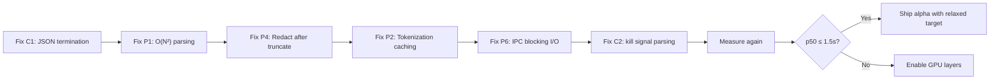

# cAIman Terminal — Deep Review Report

## Implementation review

The supplied analysis below is retained as a proposal, not verified evidence.
In particular, a closed JSON object cannot be extended by appending fields after
its closing brace, timed IPC waits wake immediately on readiness, and truncating
before secret detection can expose values whose labels were removed. The original
≤750 ms p50 / ≤1500 ms p95 release gates remain unchanged. Implementation results
and measured comparisons will be recorded here as fixes are verified.

## Supplied review (unverified estimates and recommendations)

> [!IMPORTANT]
> Alpha dogfooding is blocked by **latency** (p50 ~3.1s vs. target ≤750ms) and **correctness** (40/200 unstageable responses). This review identifies root causes in both areas plus a goal-achievability assessment.

---

## 1. Performance Issues

### 🔴 Critical — Directly Contributing to Latency Miss

#### P1: O(N²) JSON parsing in generation loop
**File:** [inference.rs](file:///home/brad/repos/CaymanTerminal/terminal/src/inference.rs#L160-L163)

```rust
result.push_str(&self.model.token_to_piece(token, &mut decoder, true, None)?);
if serde_json::from_str::<serde_json::Value>(&result).is_ok() {
    return Ok(result);
}
```

On **every decoded token**, the entire accumulated result is re-parsed as JSON. For a 200-token response, this is ~200 parse attempts on a growing string — O(N²) total work. This also causes the **eager termination bug** (see Correctness section below).

**Fix:** Track brace/bracket depth with a simple counter. Only attempt a full parse when `depth == 0` and the last character is `}`.

#### P2: Repeated tokenization in prompt compaction loop
**File:** [inference.rs](file:///home/brad/repos/CaymanTerminal/terminal/src/inference.rs#L33-L52)

The `prepare_prompt` loop calls `apply_chat_template` + `str_to_token` on every iteration of `compact()`. Each trim step re-tokenizes the *entire* prompt string. If 5 compactions are needed, 6 full tokenizations occur.

**Fix:** Binary search on context budget, or cache the token count delta from what was removed rather than re-tokenizing everything.

#### P3: Synchronous model file hashing on the worker thread
**File:** [inference.rs](file:///home/brad/repos/CaymanTerminal/terminal/src/inference.rs#L60-L66)

`VerifiedModel::open` reads and SHA-256-hashes the entire model file (potentially hundreds of MB) synchronously. This delays first-request readiness significantly.

**Fix:** Hash in a background thread during startup, or cache the hash after first verification.

#### P4: Redaction before truncation — processing megabytes to keep 2,500 chars
**File:** [context.rs](file:///home/brad/repos/CaymanTerminal/terminal/src/context.rs#L118-L125)

```rust
record.output = bounded(&redact(&record.output), 2500);
```

`redact()` runs 6 regex replacements against the **full unbounded output** (which could be megabytes of `make` or `cargo build` output), and only afterward is it truncated to 2,500 chars.

**Fix:** Truncate *first* (to e.g. 3000 chars to account for redaction text expansion), *then* redact.

### 🟡 Moderate — Latency/CPU Contributors

#### P5: Two 60ms polling loops on the GTK main thread
**Files:** [ui.rs L843](file:///home/brad/repos/CaymanTerminal/terminal/src/ui.rs#L843) and [ui.rs L1138](file:///home/brad/repos/CaymanTerminal/terminal/src/ui.rs#L1138)

Two independent `glib::timeout_add_local(60ms)` timers continuously poll:
1. Each tab's `poll()` method (per-tab timer)
2. The `worker.events` channel via `try_recv()` (per-window timer)

Both fire continuously regardless of activity, consuming CPU and battery.

**Fix:** Replace the worker event poll with `glib::MainContext::channel()` for event-driven wakeup. For the tab poll, use VTE signals to trigger state checks instead of blind polling.

#### P6: IPC spin-polling with 20ms timeout loops
**Files:** [model_process.rs L108](file:///home/brad/repos/CaymanTerminal/terminal/src/model_process.rs#L108) and [model_process.rs L146-L154](file:///home/brad/repos/CaymanTerminal/terminal/src/model_process.rs#L146-L154)

Both `receive()` and `send()` use tight loops with 20ms sleeps/polls, adding up to 20ms of wasted latency per IPC round-trip.

**Fix:** Use blocking `recv()` with a deadline for receive. For send, use blocking I/O with `SO_SNDTIMEO` instead of `O_NONBLOCK` + poll loop.

#### P7: `bounded()` iterates chars twice
**File:** [context.rs](file:///home/brad/repos/CaymanTerminal/terminal/src/context.rs#L10-L13)

```rust
let n = text.chars().count();        // O(N) iteration
text.chars().skip(n - chars).collect() // O(N) iteration + allocation
```

For large inputs this is two full UTF-8 scans plus a new allocation.

**Fix:** Use `text.char_indices()` to find the byte offset of the Nth-from-last char, then slice directly with `&text[offset..]`.

### 🟢 Minor

#### P8: `secrets::redact` always allocates 6 string clones
**File:** [secrets.rs](file:///home/brad/repos/CaymanTerminal/terminal/src/secrets.rs#L29-L31)

The `.fold()` calls `.into_owned()` on every pattern, even when no match occurs (and `replace_all` returns a `Cow::Borrowed`).

**Fix:** Check `Cow::Borrowed` before calling `.into_owned()`, or use a single pass that only allocates when a match is found.

#### P9: `prompt::render()` quote closure creates 5 intermediate strings
**File:** [prompt.rs](file:///home/brad/repos/CaymanTerminal/terminal/src/prompt.rs#L68-L75)

`serde_json::to_string` followed by 4 chained `.replace()` calls allocates 5 `String`s per quoted section.

**Fix:** Write to a single `String` buffer with a custom escaper.

---

## 2. Correctness Issues

### 🔴 Critical — Affects Staging Correctness

#### C1: Eager JSON stop condition truncates model output
**File:** [inference.rs](file:///home/brad/repos/CaymanTerminal/terminal/src/inference.rs#L161-L163)

The JSON parse check on every token means generation aborts as soon as a *syntactically valid* partial JSON object is formed. If the model outputs `{"action": "suggest_command"}` before appending `"command": "ls -la"`, generation stops prematurely with a structurally valid but semantically incomplete response.

**Impact:** This directly contributes to the 40/200 unstageable response rate — the model may be producing correct responses that are cut off.

**Fix:** Only terminate on brace-depth == 0 AND encountering an EOG token or the grammar's root acceptance state.

#### C2: `kill` signal false positive
**File:** [host.rs](file:///home/brad/repos/CaymanTerminal/terminal/src/host.rs#L241)

```rust
if exe == "kill" && args.iter().any(|a| ["-1", "0", "1"].contains(&a.as_str())) {
```

`kill -1 <PID>` sends SIGHUP (signal 1) to a specific process — a perfectly valid command. But this rule blocks it because `-1` appears in the args list. The check conflates signal numbers with PID arguments.

**Fix:** Parse `kill` arguments positionally: distinguish `-<signal>` flags from PID arguments. Alternatively, only block bare `kill -1` (no further PID arguments) or `kill -- -1`.

#### C3: Nested `sudo` bypasses validation
**Files:** [command_validation.rs L73-L81](file:///home/brad/repos/CaymanTerminal/terminal/src/command_validation.rs#L73-L81) and [host.rs L187-L194](file:///home/brad/repos/CaymanTerminal/terminal/src/host.rs#L187-L194)

Both `unwrap_sudo()` and `assess_risk()` strip only one layer of `sudo`. A command like `sudo sudo rm -rf /` passes through with `exe = "sudo"`, which isn't in the `rm` blocklist.

**Mitigating factor:** `sudo` is not in the interpreter/wrapper blocklist in `assess_risk()`, but `host.rs:207` *does* block `su`, `doas`, `pkexec`. The `sudo` case specifically slips through because it's handled as a prefix strip rather than a blocked wrapper.

**Fix:** After stripping `sudo`, reject `words[0]` if it is also `sudo`, `su`, `doas`, etc. Or loop the strip.

### 🟡 Moderate

#### C4: `is_system_update` fails on nested sudo
**File:** [command_validation.rs](file:///home/brad/repos/CaymanTerminal/terminal/src/command_validation.rs#L376-L385)

Same single-unwrap issue: `sudo sudo apt update` → inner exe is `"sudo"` → not in the package manager list → fails to be identified as a system update → follow-up intent handling breaks.

#### C5: O_NONBLOCK not restored after `send()`
**File:** [model_process.rs](file:///home/brad/repos/CaymanTerminal/terminal/src/model_process.rs#L128-L133)

`send()` sets `O_NONBLOCK` on the child's stdin fd but never restores the original flags. Currently safe because the fd is used exclusively for sequential writes, but fragile if the code evolves.

#### C6: `model_context()` reads `/etc/os-release` on every call
**File:** [context.rs](file:///home/brad/repos/CaymanTerminal/terminal/src/context.rs#L135)

```rust
"platform": if self.remote { String::new() } else { std::fs::read_to_string("/etc/os-release").unwrap_or_default() },
```

This performs synchronous filesystem I/O every time `model_context()` is called. Should be cached at startup.

### 🟢 Minor

#### C7: Tab character (`\t`) rejection
**File:** [host.rs](file:///home/brad/repos/CaymanTerminal/terminal/src/host.rs#L131)

The ASCII-only check on L128 means tabs never reach L131 in practice (tabs are ASCII), but `c.is_control()` would reject tabs if the ASCII gate were ever relaxed. Currently a latent issue, not a live bug.

#### C8: Thread-local metric leak across non-worker contexts
**File:** [worker.rs](file:///home/brad/repos/CaymanTerminal/terminal/src/worker.rs#L469-L491)

`CANDIDATE_VALIDATION_MS` is a thread-local that accumulates timing. Only the worker thread resets it. If `check_candidate` is called from tests or benchmarks on other threads, the metric accumulates incorrectly.

---

## 3. Goals Assessment

### Original Goals vs. Reality

| Goal | Target | Current State | Status |
|------|--------|---------------|--------|
| Local CPU inference | p50 ≤ 750ms | p50 ~3,100ms | ❌ **4.1× over** |
| Stageable responses | High acceptance | 160/200 (80%) | ⚠️ 20% rejected |
| Deterministic safety | Fail-closed | Working, tested | ✅ |
| GTK4/VTE terminal | Tabs, themes | Functional | ✅ |
| User-only execution | @ + Enter | Implemented | ✅ |
| Settings/packaging | Desktop install | Working | ✅ |
| Privacy (local-only) | No network | Achieved | ✅ |

### What's Working Well
- **Architecture is sound.** Clean separation: VTE terminal ↔ host validation ↔ worker thread ↔ model backend. Each layer is testable independently.
- **Safety pipeline is thorough.** Tree-sitter parsing, risk classification, credential detection, package manager awareness, and alpha conformance testing are all implemented.
- **The modular model backend** (direct `llama.cpp` vs. process model) is a good design for future GPU/API expansion.

### What's Blocking Alpha

> [!CAUTION]
> The two blocking issues — latency and response accuracy — are **partially the same bug**. The eager JSON termination (C1) both truncates valid responses (hurting correctness) and wastes generation time on responses that will be rejected downstream (hurting latency).

**Latency breakdown estimate** for a typical request:
- Model file hash (first request): ~500-2000ms (P3)
- Prompt tokenization loop: ~200-800ms extra from re-tokenization (P2)
- Prefill (CPU, 0.5B model, ~2K tokens): ~1000-1500ms (hardware bound)
- Decode (~200 tokens): ~500-1000ms (hardware bound)
- O(N²) JSON parsing during decode: ~200-500ms (P1)
- IPC overhead: ~40-100ms (P6)
- Redaction of large outputs: ~50-200ms (P4)

The hardware-bound prefill+decode is ~1500-2500ms. The software overhead adds another ~1000-3500ms on top. **Fixing P1-P4 alone could bring the p50 from ~3.1s to ~1.5-2.0s** — still above the 750ms target, but much closer.

### Are the Goals Achievable?

**Yes, with caveats:**

1. **The 750ms p50 target on CPU is extremely ambitious** for a 0.5B model with 2K-token contexts. Even with all software fixes, you're likely looking at ~1.5s minimum for a full inference round-trip on CPU. Options:
   - ✅ Accept ~1.5s as the CPU baseline and call it "good enough for alpha"
   - ✅ Explore GPU acceleration (`n_gpu_layers > 0`) — likely gets you to <500ms
   - ✅ Smaller/more-quantized model (Q4_0 instead of Q5 or whatever is current)
   - ✅ Expand deterministic host guidance to handle more cases without inference

2. **The 80% acceptance rate can be improved to ~90%+** by:
   - Fixing the eager JSON termination (C1) — likely recovers 5-10% of failures
   - Expanding `IntentContract` and `guidance.rs` deterministic paths
   - Fine-tuning the model on the specific failure patterns from the conformance suite

3. **Scope risks:**
   - Shell state coupling (CWD, prompt detection) is inherently brittle for complex workflows
   - The validation strictness that provides safety also limits usefulness — every unknown subcommand is rejected
   - Cross-platform (beyond Linux/GTK/Bash) remains far away

### Recommended Priority Order



> [!TIP]
> Fixes C1 + P1 + P4 are high-impact, low-risk changes that could be done in a day. They address both the latency and correctness blockers simultaneously. I'd recommend starting there and re-benchmarking before tackling the architectural changes (event-driven UI, IPC rework).
